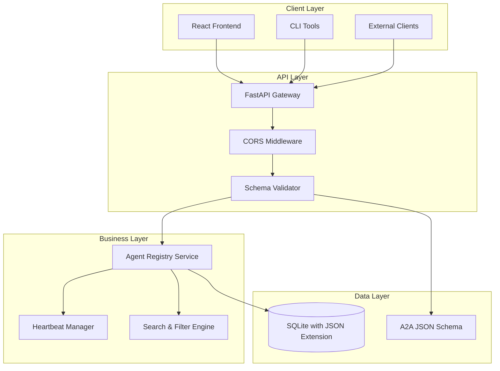
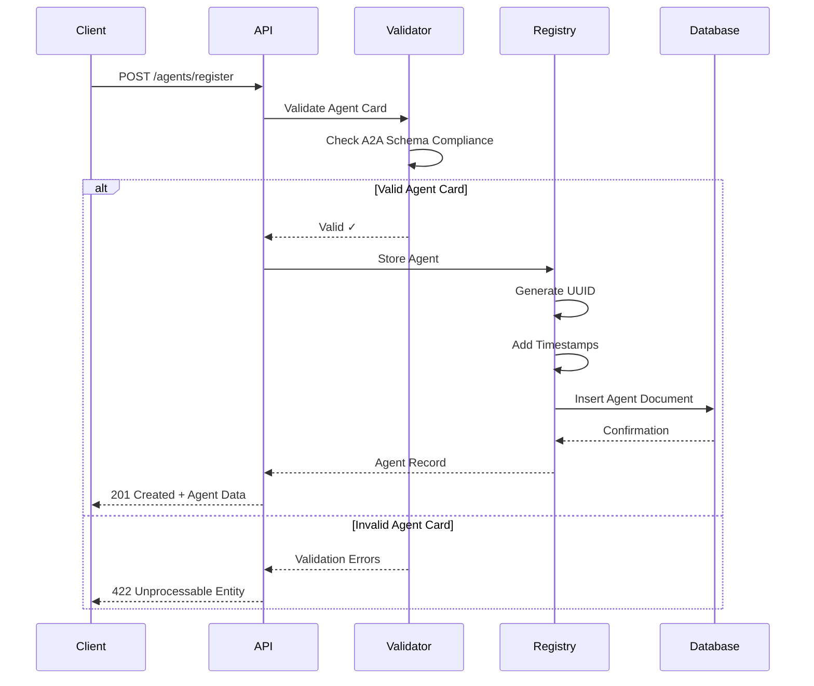
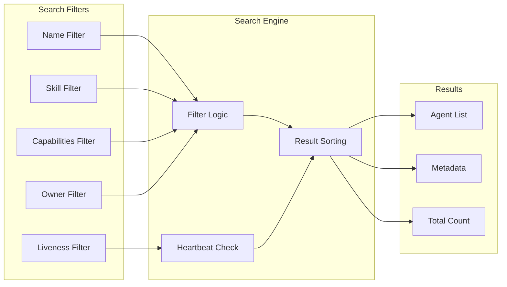
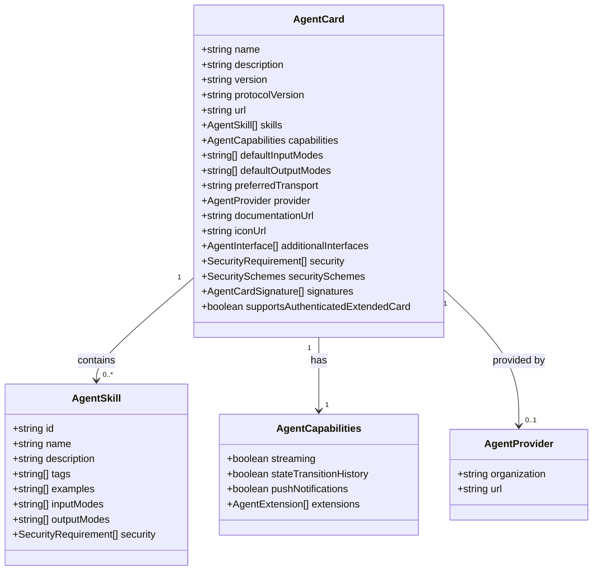

# Agent-Reg: A2A Registry Platform

A comprehensive centralized registry for Agent2Agent (A2A) protocol compliant agents, providing discovery, management, and invocation services for AI agents.

## 🏗️ Architecture Overview


Agent-Reg is built as a modern full-stack application with two main components:

### Backend (FastAPI)
- **Framework**: FastAPI with Python 3.8+
- **Database**: SQLite with JSON Extension
- **Schema Validation**: A2A protocol compliance using JSON Schema
- **API Standard**: RESTful API following OpenAPI 3.0 specification

### Frontend (React)
- **Framework**: React 18+ with TypeScript
- **Styling**: Tailwind CSS
- **HTTP Client**: Axios
- **UI Components**: Headless UI components

## 🖥️ System Architecture



## Agent Registration Workflow



## 🔍 Agent Discovery & Search



## 🗂️ Data Models

### Agent Card Schema (A2A Compliant)



## 🏗️ Core Features

### Agent Management
- **Registration**: Add new A2A compliant agents to the registry
- **Discovery**: Search and filter agents by multiple criteria
- **Lifecycle**: Update agent information and manage liveness
- **Removal**: Delete agents from the registry

### A2A Protocol Compliance
- **Schema Validation**: Enforce A2A Agent Card schema compliance
- **Protocol Support**: Support for JSON-RPC, gRPC, and HTTP+JSON transports
- **Security**: Support for various authentication schemes (OAuth2, API Keys, mTLS)
- **Extensions**: Handle protocol extensions and custom capabilities

### Advanced Search & Filtering
- **Multi-criteria Search**: Filter by name, skills, capabilities, owner
- **Liveness Monitoring**: Track agent availability via heartbeat mechanism
- **Capability-based Discovery**: Find agents by specific capabilities
- **Tag-based Search**: Discover agents using skill tags

## 🗂️ Project Structure

```
agent-reg/
  backend/                    # FastAPI Backend
    app/
      src/
        main.py                    # FastAPI application entry point
        agent_card_models.py       # Pydantic models for A2A schema
        agent_card_validator.py    # Schema validation logic
        a2a_agent_card_schema.json # A2A JSON Schema definition
      resources/
        sample_cards/              # Example agent cards
      test/                        # API test scripts
      requirements.txt             # Python dependencies

  frontend/                   # React Frontend
    src/
      components/                    # React components
        AgentCard.tsx             # Individual agent display
        AgentFilters.tsx          # Search and filter UI
        AddAgentModal.tsx         # Agent registration form
        Layout.tsx                # Application layout
      services/
        api.ts                    # API client service
      types/
        agent.ts                  # TypeScript type definitions
      App.tsx                     # Main application component
    package.json                  # Node.js dependencies
    tailwind.config.js            # Tailwind CSS configuration

  README.md                   # This documentation
```

## API Endpoints

### Agent Management

| Method | Endpoint | Description | Request Body | Response |
|--------|----------|-------------|--------------|----------|
| `POST` | `/agents/register` | Register a new agent | `AgentCard` | `Agent` |
| `GET` | `/agents` | List and search agents | Query params | `Agent[]` |
| `GET` | `/agents/{id}` | Get specific agent | - | `Agent` |
| `PUT` | `/agents/{id}` | Update agent | `AgentUpdate` | `Agent` |
| `DELETE` | `/agents/{id}` | Delete agent | - | `204 No Content` |

### Agent Operations

| Method | Endpoint | Description | Response |
|--------|----------|-------------|----------|
| `POST` | `/agents/{id}/heartbeat` | Update agent liveness | `Agent` |
| `GET` | `/agents/{id}/invoke_url` | Get invocation details | `AgentInvokeResponse` |

### System Health

| Method | Endpoint | Description | Response |
|--------|----------|-------------|----------|
| `GET` | `/health` | System health check | `HealthResponse` |

### Query Parameters for Agent Search

| Parameter | Type | Description |
|-----------|------|-------------|
| `name` | `string` | Filter by agent name (case-insensitive) |
| `skill` | `string` | Filter by specific skill ID |
| `owner` | `string` | Filter by agent owner |
| `capabilities` | `string` | Comma-separated list of required capabilities |
| `only_alive` | `boolean` | Show only agents with recent heartbeat (last 5 minutes) |

## ⚡ Quick Start

### Prerequisites

- **Backend**: Python 3.8+, pip
- **Frontend**: Node.js 16+, npm/yarn
- **Database**: No additional setup required (uses file-based SQLite with JSON extension)

### Backend Setup

```bash
cd backend/app
pip install -r requirements.txt
python src/main.py
```

The API will be available at `http://localhost:8000`

### Frontend Setup

```bash
cd frontend
npm install
npm start
```

The web interface will be available at `http://localhost:3000`

## 🚦 Usage Examples

### Register an Agent

```bash
curl -X POST "http://localhost:8000/agents/register" \
  -H "Content-Type: application/json" \
  -d '{
    "name": "GeoSpatial Route Planner Agent",
    "description": "Provides advanced route planning services",
    "version": "1.2.0",
    "protocolVersion": "0.3.0",
    "url": "https://georoute-agent.example.com/a2a/v1",
    "capabilities": {
      "streaming": true,
      "pushNotifications": true,
      "stateTransitionHistory": false
    },
    "defaultInputModes": ["application/json", "text/plain"],
    "defaultOutputModes": ["application/json", "image/png"],
    "skills": [
      {
        "id": "route-optimizer-traffic",
        "name": "Traffic-Aware Route Optimizer",
        "description": "Calculates optimal routes considering real-time traffic",
        "tags": ["maps", "routing", "navigation", "traffic"]
      }
    ]
  }'
```

### Search for Agents

```bash
# Find all agents with streaming capability
curl "http://localhost:8000/agents?capabilities=streaming"

# Find agents by skill
curl "http://localhost:8000/agents?skill=route-optimizer-traffic"

# Find only active agents
curl "http://localhost:8000/agents?only_alive=true"
```

### Agent Heartbeat

```bash
curl -X POST "http://localhost:8000/agents/{agent-id}/heartbeat"
```

## 🛠️ Configuration

### Environment Variables

#### Backend
- `DATABASE_PATH`: Path to the SQLite database file (default: `agent_reg.db`)

#### Frontend
- `REACT_APP_API_URL`: Backend API URL (default: `http://localhost:8000`)

## 🧪 Testing

### Backend API Testing

Test scripts are provided in `backend/app/test/`:

```bash
cd backend/app/test
# Register an agent
./01.register.sh

# List agents
./02.list_agents.sh

# Update heartbeat
./03.agent_heartbeat.sh

# Delete agent
./04.agent_delete.sh
```

### Frontend Testing

```bash
cd frontend
npm test
```

## 🛡️ Security

### A2A Protocol Security Features

- **Authentication**: Support for OAuth2, OpenID Connect, API Keys, mTLS
- **Authorization**: Fine-grained security requirements per agent and skill
- **Signature Verification**: JSON Web Signature (JWS) support for agent cards
- **Transport Security**: HTTPS enforcement for production environments

### Input Validation

- **Schema Validation**: All agent cards validated against A2A JSON Schema
- **Data Sanitization**: Input data sanitized to prevent injection attacks
- **CORS Policy**: Configurable CORS middleware for cross-origin requests

## 📈 Monitoring & Observability

### Health Monitoring

- **Health Check Endpoint**: `/health` provides system status
- **Agent Liveness**: Heartbeat mechanism tracks agent availability

### Logging

- **Structured Logging**: JSON format logs for better parsing
- **Request Tracing**: HTTP request/response logging
- **Error Handling**: Comprehensive error reporting

## 🚀 Deployment

### Production Deployment

1. **Backend Deployment**:
   ```bash
   pip install -r requirements.txt
   uvicorn main:app --host 0.0.0.0 --port 8000
   ```

2. **Frontend Deployment**:
   ```bash
   npm run build
   # Serve static files with nginx/Apache
   ```

### Docker Deployment

```dockerfile
# Backend Dockerfile
FROM python:3.9-slim
WORKDIR /app
COPY requirements.txt .
RUN pip install -r requirements.txt
COPY src/ .
EXPOSE 8000
CMD ["uvicorn", "main:app", "--host", "0.0.0.0", "--port", "8000"]
```

```dockerfile
# Frontend Dockerfile
FROM node:16-alpine
WORKDIR /app
COPY package*.json ./
RUN npm install
COPY . .
RUN npm run build
FROM nginx:alpine
COPY --from=0 /app/build /usr/share/nginx/html
```

## 🤝 Contributing

### Development Setup

1. **Clone Repository**:
   ```bash
   git clone <repository-url>
   cd agent-reg
   ```

2. **Backend Development**:
   ```bash
   cd backend/app
   pip install -r requirements.txt
   python src/main.py
   ```

3. **Frontend Development**:
   ```bash
   cd frontend
   npm install
   npm start
   ```

### Code Quality

- **Backend**: Follow PEP 8 Python style guidelines
- **Frontend**: Use ESLint and Prettier for code formatting
- **Testing**: Maintain test coverage for new features
- **Documentation**: Update README for any architectural changes

## 📚 References

- [Agent2Agent Protocol Specification](https://agent2agent.ai)
- [FastAPI Documentation](https://fastapi.tiangolo.com)
- [React Documentation](https://react.dev)
- [SQLite Documentation](https://www.sqlite.org/docs.html)
- [JSON Schema Specification](https://json-schema.org)

## 📝 License


This project is licensed under the MIT License - see the LICENSE file for details.

## 🆘 Support

For issues, questions, or contributions, please:
1. Check existing issues in the repository
2. Create a new issue with detailed description
3. Follow the contribution guidelines for pull requests

---

**Agent-Reg** - Empowering AI Agent Discovery and Collaboration through the Agent2Agent Protocol